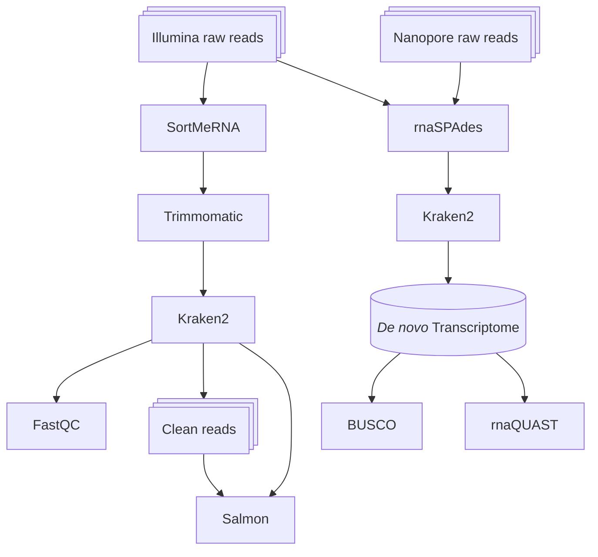

# _Phragmites_ RNAseq
## Transcriptomic analysis of _Phragmites australis_ gene expression under drought stress

### Workflow:

```mermaid
flowchart TB
    A@{shape: procs, label: "Illumina raw reads"} --> B[SortMeRNA];
    B --> C[Trimmomatic];
    C --> K[Kraken2];
    K --> E[FastQC];
    K --> F@{shape: procs, label: "Clean reads"};
    A --> G[rnaSPAdes];
    AA@{shape: procs, label: "Nanopore raw reads"} --> G[rnaSPAdes];
    G --> K2[Kraken2];
    K2 -->T@{shape: cyl, label: "_De novo_ Transcriptome"};
    T --> BU[BUSCO];
    T --> Q[rnaQUAST];
    K --> S[Salmon];
    F --> S[Salmon];

```
