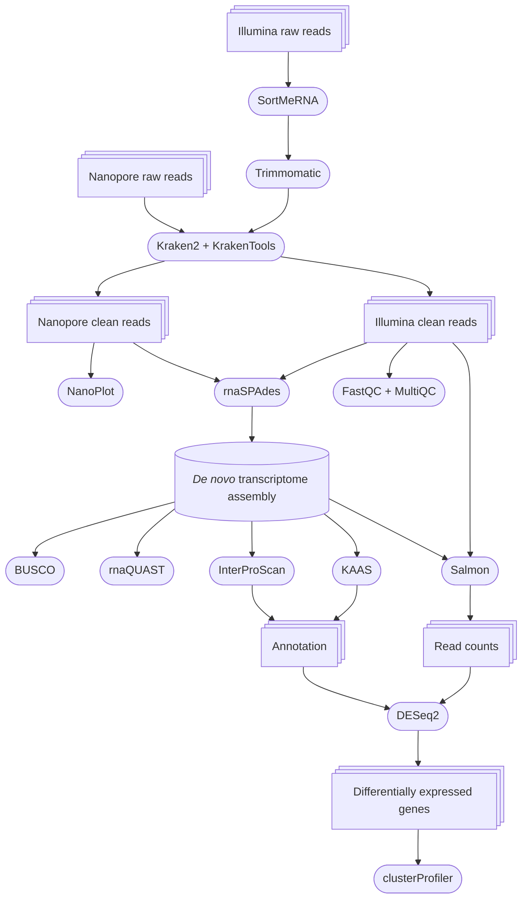

# _Phragmites_ RNAseq
## Transcriptomic analysis of _Phragmites australis_ gene expression under drought stress

> [!TIP]
> To view any HTML file, please, download it

### Used programs:

* [SortMeRNA](https://academic.oup.com/bioinformatics/article/28/24/3211/246053?login=true) v4.3.4 - filtering out rRNA
* [Trimmomatic](http://www.usadellab.org/cms/index.php?page=trimmomatic) v0.33 - trimming of adapters, low-quality bases and removing of low-quality reads
* [Kraken2](https://genomebiology.biomedcentral.com/articles/10.1186/s13059-019-1891-0) and [KrakenTools](https://github.com/jenniferlu717/KrakenTools) v1.2 - filtering out contaminating reads
* [FastQC](https://www.bioinformatics.babraham.ac.uk/projects/fastqc/) v0.12.0, [MultiQC](https://seqera.io/multiqc/) v1.14, and [NanoPlot](https://github.com/wdecoster/NanoPlot?tab=readme-ov-file) v1.43.0 - read quality reports
* [rnaSPAdes](https://bmcbioinformatics.biomedcentral.com/articles/10.1186/s12859-020-03614-2) v3.15.4  - transcriptome assembling
* [RNAquast](https://academic.oup.com/bioinformatics/article/32/14/2210/1743439) v2.2.3 and [BUSCO](https://busco.ezlab.org/) v5.4.4 - transcriptome quality assessment
* [KAAS](https://www.genome.jp/kegg/kaas/) v2.1 and [InterProScan](https://interproscan-docs.readthedocs.io/en/latest/Introduction.html) v5.72-103.0 - transcriptome annotation
* [Salmon](https://combine-lab.github.io/salmon/) v1.10.3 - read quantification
* [DESeq2](https://genomebiology.biomedcentral.com/articles/10.1186/s13059-014-0550-8) v1.44.0 R package - read counts normalisation and differential gene expression analysis
* [clusterProfiler](https://pmc.ncbi.nlm.nih.gov/articles/PMC3339379/) v4.12.6 R package - enrichment analysis for differentially expressed genes

### Workflow:

