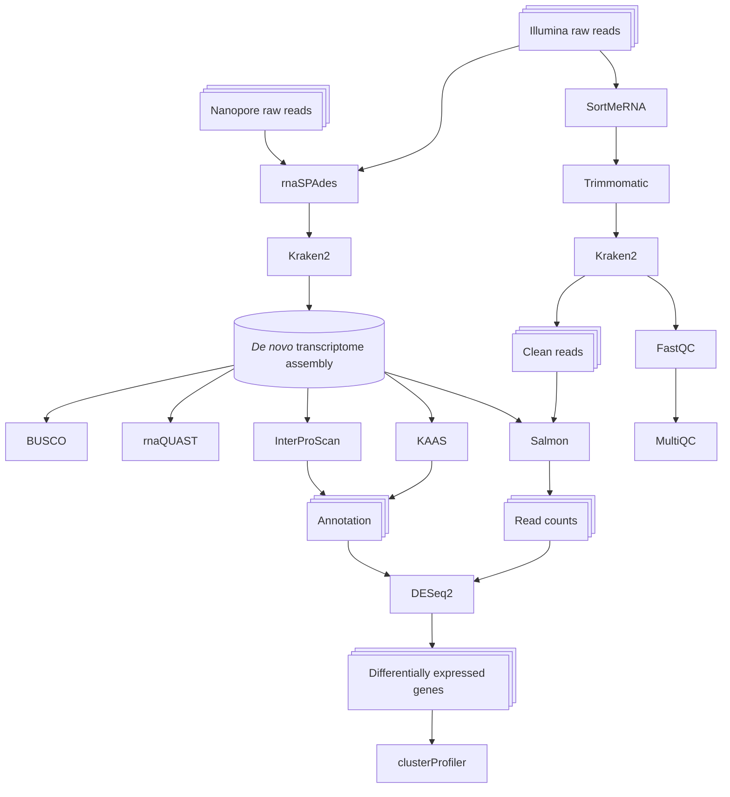

# _Phragmites_ RNAseq
## Transcriptomic analysis of _Phragmites australis_ gene expression under drought stress

### Used programs:

* SortMeRNA v4.3.4 - filtering out rRNA
* Trimmomatic v0.33 - trimming of adapters, low-quality bases and removing of low-quality reads
* Kraken2 - filtering out conatminating reads
* FastQC v0.12.0 and MultiQC v1.14 - read quality report
* rnaSPAdes v3.15.4  - transcriptome assembling
* RNAquast v2.2.3 and BUSCO v5.4.4 - transcriptome quality assessment
* KAAS v2.1 and InterProScan v5.61-93.0 - transcriptome annotation
* Salmon v1.10.3 - read quantification
* DESeq2 v1.44.0 - read counts normalisation and differential gene expression analysis
* clusterProfiler v4.12.6 - enrichment analysis for differentially expressed genes

### Workflow:

